This guide walks through the minimum configuration required to register your
first sample in SENAITE and move it through every workflow state to publication.

---

## Prerequisites

SENAITE ships without any pre-configured data. Before you can register a
sample, you need to set up a few items. All configuration is done through the
**LIMS Setup** screen.

Navigate to LIMS Setup by clicking the gear icon in the upper-right corner of
any screen. You can also press `Ctrl+Space` to open the Spotlight Search and
type the name of the setup item you want to reach.

---

## Step 1: Add a Lab Department

Click **Lab Departments** in the setup screen, then click **Add**.

Enter the following values and click **Save**:

| Field       | Value                          |
|-------------|--------------------------------|
| Title       | `Chemistry`                    |
| Description | `Analytical chemistry department` |

---

## Step 2: Add an Analysis Category

Analysis categories group related analyses together, independent of department.

Click **Analysis Categories** in the setup screen, then click **Add**.

Enter the following values and click **Save**:

| Field       | Value                    |
|-------------|--------------------------|
| Title       | `Water Chemistry`        |
| Description | `Chemical water analyses` |
| Department  | `Chemistry`              |

---

## Step 3: Add Analysis Services

Analysis services represent the test catalog — the individual measurements your
laboratory performs. Each service has a keyword that must be unique across the
system.

Click **Analysis Services** in the setup screen, then click **Add**.

Create the following three services one by one:

**Calcium**

| Field              | Value           |
|--------------------|-----------------|
| Title              | `Calcium`       |
| Unit               | `mg/L`          |
| Analysis Keyword   | `Ca`            |
| Point of Capture   | `Lab`           |
| Analysis Category  | `Water Chemistry` |
| Department         | `Chemistry`     |

**Magnesium** — use keyword `Mg`

**Total Hardness** — use keyword `THCaCO3`

:::tip
You can duplicate an existing analysis service from the listing view by
selecting its checkbox and clicking **Duplicate**.
:::

:::note
The analysis keyword is used in calculations, instrument result imports, and
can be shown in result reports. CAS numbers or LOINC codes are good choices
for standardized labs.
:::

---

## Step 4: Add a Sample Type

Sample types control how samples are classified and how their IDs are
generated.

Click **Sample Types** in the setup screen, then click **Add**.

Enter the following values and click **Save**:

| Field          | Value    |
|----------------|----------|
| Title          | `Water`  |
| Prefix         | `H2O`    |
| Minimum Volume | `100 ml` |

:::note
The prefix appears in the generated sample ID. Keep it short and meaningful.
:::

---

## Step 5: Add a Client

All samples in SENAITE belong to a client. For non-contract laboratories,
create a single client that represents your own organization.

Navigate to **Clients** using the left-hand sidebar, then click **Add**.

Enter the following values and click **Save**:

| Field     | Value        |
|-----------|--------------|
| Name      | `Happy Hills` |
| Client ID | `HH`         |

---

## Step 6: Add a Client Contact

Each client needs at least one contact person. The contact is required when
creating a sample and is the recipient of published result reports.

Open the newly created `Happy Hills` client and click the **Contacts** tab,
then click **Add** and fill in the contact details, then click **Save**.

:::note
The contact's email address is used when sending result reports. Ensure a mail
server is configured in the LIMS setup if you intend to send emails.
:::

---

## Registering a Sample

Open the `Happy Hills` client and click the **Samples** tab. Select `1` from
the count selector next to the **Add** button and click **Add**.

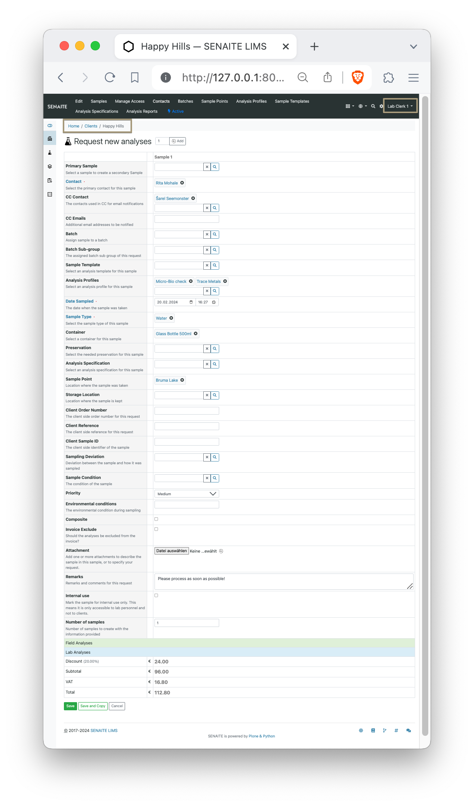

:::tip
The count selector lets you register multiple samples in a single step. Each
column in the form represents one sample. Set the count before clicking
**Add** — changing it afterwards reloads the form and clears entered values.
:::

:::tip
Click **Manage Form Fields** in the upper-left corner of the form to show,
hide, and reorder the available fields.
:::

Fill in the following fields:

| Field         | Value                                     |
|---------------|-------------------------------------------|
| Contact       | The contact you created in Step 6         |
| Date Sampled  | Click **now** in the date picker          |
| Sample Type   | `Water`                                   |
| Lab Analyses  | `Calcium`, `Magnesium`, `Total Hardness`  |

Click **Save**.

The sample is created and appears in the listing with status **Sample Due**.
The sample ID is generated automatically using the sample type prefix — for
example `H2O-0001`.

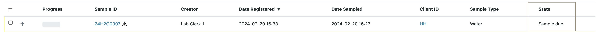

**Sample Due** means the physical sample has not yet arrived at the laboratory.
This is useful when samples are registered in advance and labeled before
collection.

---

## Sample Workflow

### Receive the Sample

When the physical sample arrives, a Lab Clerk receives it to confirm its
condition and suitability for analysis.

Select the sample in the listing and click **Receive**.

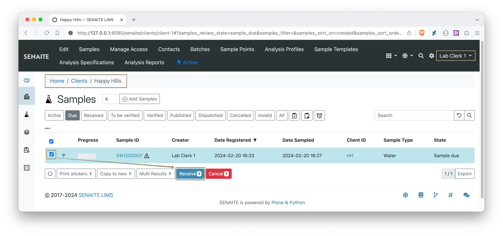

The sample transitions to **Received** status.

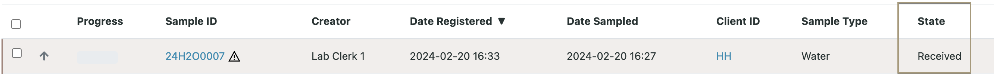

:::note
For in-house laboratories that collect and analyze their own samples, you can
enable **Auto-Receive Samples** in the LIMS setup to skip this step.
:::

### Submit Results

Open the received sample by clicking its ID.

Enter the result values in the analyses table and click **Submit**.

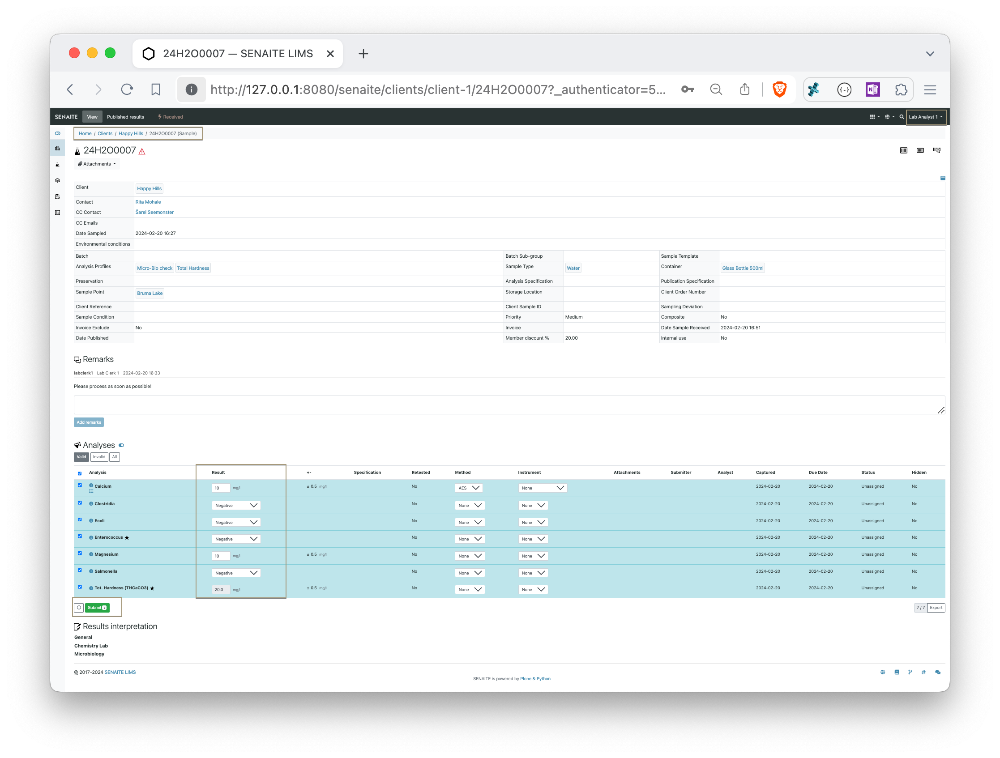

:::info
Clicking **Save** before **Submit** stores the results without submitting them
for review. The system runs server-side recalculations and out-of-range checks
on save.
:::

After submitting all results, the sample transitions to **To be verified**
status.

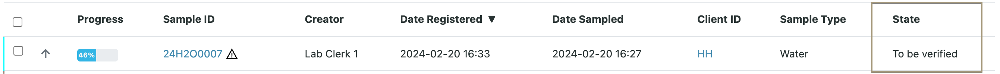

### Verify Results

Verification is performed by a Lab Manager or a user with the Verifier role.
It is the final quality check before results are released to the client.

Open the sample and click **Verify**.

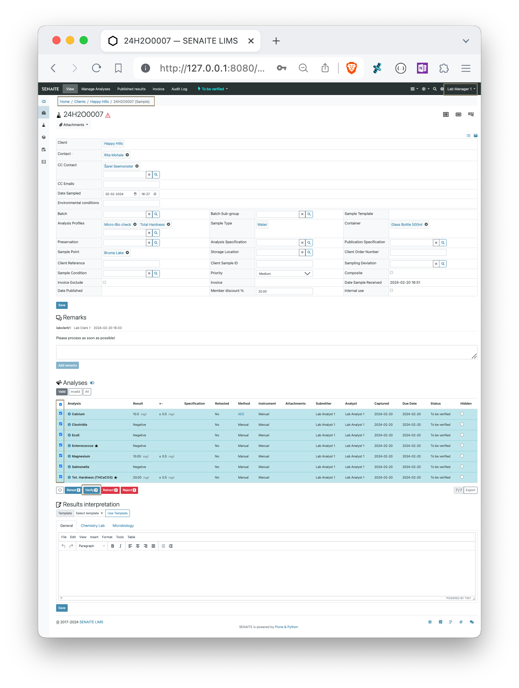

:::note
Once verified, analyses cannot be reversed unless the entire sample is
invalidated. Client contacts with system access can view verified results
before publication.
:::

The sample transitions to **Verified** status.

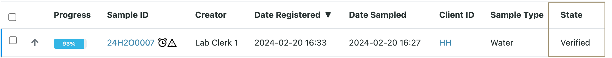

### Publish Results

Select the verified sample in the listing and click **Publish**. This opens
the SENAITE Impress report preview with the default report template.

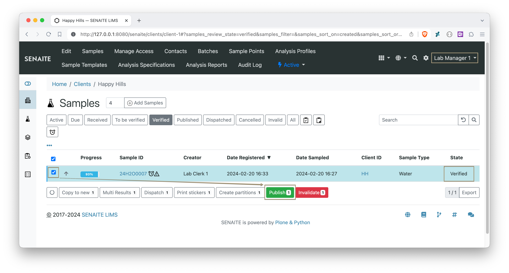

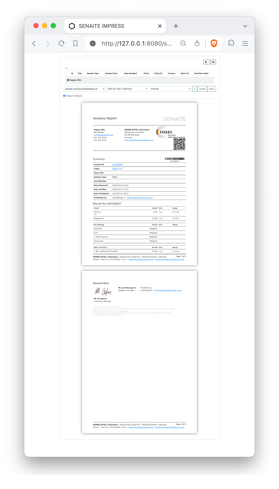

:::info
The standard templates are provided as examples. Contact your service provider
to customize report templates to fit your laboratory's requirements.
:::

Click **Save** to generate the results report PDF and store it in the system,
or **Email** to generate the report and open the email composition form.

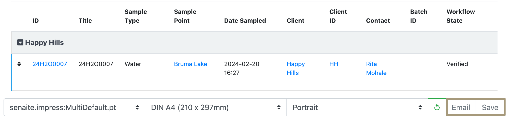

To publish the sample without sending an email, click **Publish** in the
Impress toolbar.

:::important
Generating the PDF via **Save** does not automatically publish the sample. The
sample transitions to **Published** status only after clicking **Publish** or
sending the report via **Email**.
:::

The sample is now in **Published** status — the final state in the basic
workflow.

---

## Next Steps

With the basic workflow complete, you can explore:

- **Analysis Profiles** — pre-defined sets of analyses to speed up sample
  registration.
- **Analysis Templates** — profiles combined with sample type and other
  default values.
- **Worksheets** — plan and assign analyses to analysts in batch.
- **Sample Partitions** — split a received sample into aliquots for separate
  analysis.
- **Specifications** — define valid result ranges and trigger out-of-range
  warnings.

Refer to the [community forum](https://community.senaite.org) for further
guidance or to ask questions.
